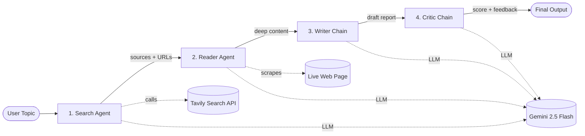

<div align="center">

# 🔍 Deep Research Agent

**An autonomous, multi-agent AI research assistant built with LangChain & Google Gemini**

Give it a topic — it searches the web, reads the best source, writes a structured report, and critiques its own work.

[]()
[]()
[]()
[]()
[]()

</div>

---

## 📖 Table of Contents

- [Overview](#-overview)
- [Architecture](#-architecture-multi-agent-orchestration)
- [How It Works](#️-how-it-works)
- [Tech Stack](#️-tech-stack)
- [Project Structure](#-project-structure)
- [Getting Started](#-getting-started)
- [Configuration](#️-configuration)
- [Key Features](#-key-features)
- [Limitations & Roadmap](#-limitations--roadmap)
- [What This Project Demonstrates](#-what-this-project-demonstrates)

---

## 🚀 Overview

The **Deep Research Agent** is an autonomous research assistant that turns a single topic into a polished, cited report. Rather than leaning on one giant prompt, it splits the work across **four specialized components** — mimicking how a real research team operates: one member gathers sources, one reads deeply, one writes, and one reviews.

The result is output that's **grounded in live web data** (not the model's stale memory) and **quality-checked** before you ever see it.

```
   "The impact of quantum computing on cybersecurity"
                        │
                        ▼
        🔎 search → 📖 read → ✍️ write → ⭐ critique
                        │
                        ▼
      📋 Structured, cited report  +  ⭐ Quality score /10
```

---

## 🧠 Architecture: Multi-Agent Orchestration

Instead of a single monolithic prompt, responsibilities are delegated to focused agents and chains. A deterministic Python pipeline orchestrates the flow and passes state between stages.



| Stage | Type | Role | What it does |
|-------|------|------|--------------|
| **1. Search Agent** | Agent + `web_search` tool | The Gatherer | Uses the Tavily API to find recent, reliable sources for the topic. |
| **2. Reader Agent** | Agent + `scrape_url` tool | The Analyst | Picks the most relevant URL and scrapes it for deep, full-text content. |
| **3. Writer Chain** | LCEL chain (no tools) | The Synthesizer | Combines the research into a structured report: intro, key findings, conclusion, sources. |
| **4. Critic Chain** | LCEL chain (no tools) | The Reviewer | Grades the draft, listing strengths, weaknesses, and a score out of 10. |

> **Why agents *and* chains?** Steps that must *act* on the outside world (search, scrape) are **agents** with tools. Steps that only *transform text* (write, critique) are lightweight **chains** — faster, cheaper, and fully deterministic.

---

## ⚙️ How It Works

The pipeline threads a single `state` dictionary through all four stages — each stage reads what it needs and writes its result:

```
topic ─▶ [Search] ─▶ search_result ─▶ [Reader] ─▶ scraped_content
                            │                            │
                            └──────────────┬─────────────┘
                                           ▼
                     [Writer] ─▶ report ─▶ [Critic] ─▶ feedback ─▶ 🖥️ UI
```

- **Grounded output** — the writer only sees real search results + scraped text, which keeps it factual and reduces hallucination.
- **`temperature=0`** — the model runs deterministically for reproducible, factual research.
- **Fail-soft** — a dead link or flaky request returns an error string instead of crashing the whole run.
- **Live progress** — the Streamlit UI shows each stage in real time via a progress callback.

---

## 🛠️ Tech Stack

| Layer | Technology |
|-------|-----------|
| **LLM** | Google Gemini 2.5 Flash (`langchain-google-genai`) |
| **Orchestration** | LangChain (agents, chains, prompts, LCEL) + a plain Python pipeline |
| **Web Search** | Tavily — a search API built for LLMs |
| **Scraping** | `requests` + BeautifulSoup |
| **UI** | Streamlit |
| **Config** | `python-dotenv` for secret management |

---

## 📁 Project Structure

```
Deep Research Agent Langchain/
├── app.py             # Streamlit UI — the entry point for users
├── pipeline.py        # Orchestrator — runs the 4 stages in order
├── agents.py          # The LLM, the 2 tool-using agents, and the 2 chains
├── tools.py           # web_search (Tavily) + scrape_url (requests + BS4)
├── requirements.txt   # Python dependencies
├── .env               # Your API keys (gitignored — never committed)
└── README.md
```

---

## 🏁 Getting Started

### Prerequisites
- Python 3.9+
- A **Google Gemini** API key → [aistudio.google.com/apikey](https://aistudio.google.com/apikey)
- A **Tavily** API key → [tavily.com](https://tavily.com)

### 1. Clone the repository
```bash
git clone https://github.com/tygopal45/Deep_Research_Agent_Langchain.git
cd Deep_Research_Agent_Langchain
```

### 2. Create a virtual environment & install dependencies
```bash
python -m venv .venv
source .venv/bin/activate        # Windows: .venv\Scripts\activate
pip install -r requirements.txt
```

### 3. Add your API keys
Create a `.env` file in the project root:
```env
GOOGLE_API_KEY=your_gemini_api_key_here
TAVILY_API_KEY=your_tavily_api_key_here
```

### 4. Run the app
```bash
streamlit run app.py
```
Then open the local URL Streamlit prints (usually `http://localhost:8501`).

> 💡 Prefer the terminal? Run `python pipeline.py` for a quick, UI-less test.

---

## ⚙️ Configuration

| Variable | Required | Description |
|----------|:--------:|-------------|
| `GOOGLE_API_KEY` | ✅ | Gemini API key (powers all four stages) |
| `TAVILY_API_KEY` | ✅ | Tavily key (powers the Search Agent) |

Both keys are **validated at startup** — if either is missing, the app fails fast with a clear message and a link to get one, instead of erroring out mid-request.

---

## 🌟 Key Features

- **🤖 Autonomous research** — one topic in, a full cited report out.
- **⭐ Self-evaluation** — a built-in critic reviews and scores every report, reducing low-quality or unsupported output.
- **🌐 Grounded in live data** — answers are based on freshly searched and scraped web content, not the model's frozen training data.
- **🔍 Transparent logs** — inspect exactly what each agent found (raw search results + scraped content) in the UI.
- **🧩 Modular by design** — adding a new stage (e.g. a Fact-Checker) is a small, isolated change.
- **🛡️ Robust config** — startup key validation and fail-soft scraping.

---

## 🚧 Limitations & Roadmap

Honest about where it stands today and where it could go:

| Current limitation | Planned improvement |
|--------------------|---------------------|
| Reads a single scraped URL | Scrape top-N sources concurrently and merge |
| Synchronous / blocking run | Async job queue + worker pool for concurrency |
| No caching (re-runs from scratch) | Cache by topic hash + semantic cache |
| Hard text truncation | Chunk → embed → retrieve (true vector-DB RAG) |
| No retries on transient failures | Exponential backoff + fallback model/provider |
| Critic only scores | Critic → revise loop (via LangGraph) |

---

## 📈 What This Project Demonstrates

- **LLM orchestration** — coordinating multiple model calls toward a complex, multi-step goal.
- **Agentic design patterns** — specialized Search / Read / Write / Critic roles instead of one zero-shot prompt.
- **Tool integration & grounding** — connecting an LLM to external APIs and a web scraper for real-time, factual data.
- **Clean full-stack delivery** — wrapping non-trivial backend AI logic in a friendly Streamlit interface.

---

<div align="center">
  <i>Built with ❤️ using LangChain, Gemini, and Streamlit.</i>
</div>
