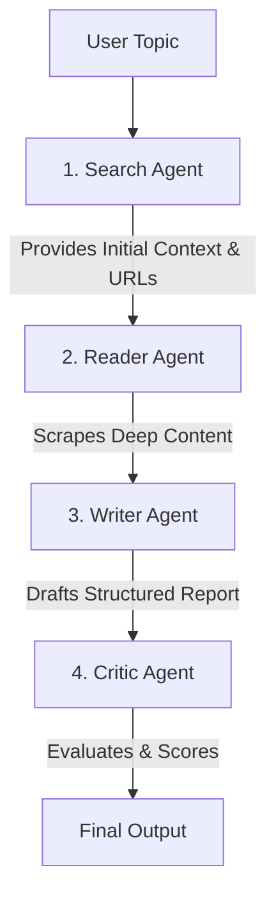

<div align="center">
  <h1>🔍 Deep Research Agent</h1>
  <p><strong>A Multi-Agent Orchestration System Powered by LangChain and Gemini</strong></p>
  
  []()
  []()
  []()
  []()
</div>

<br>

## 🚀 Overview

The **Deep Research Agent** is an advanced, autonomous AI research assistant built using **LangChain** and **multi-agent orchestration**. Designed to handle complex research queries, the system intelligently breaks down tasks, gathers real-time data from the web, synthesizes deep insights, and critically evaluates its own output before presenting a polished final report. 

This project demonstrates expertise in building **agentic workflows**, managing **stateful pipelines**, and implementing **LLM-driven task delegation**.

## 🧠 Architecture: Multi-Agent Orchestration

The core strength of this application lies in its highly structured, multi-step agentic pipeline. Instead of relying on a single monolithic prompt, the system delegates specific responsibilities to specialized agents, mimicking a real-world research team.

### The Pipeline Workflow



1. **Search Agent**: 
   - **Role**: The Information Gatherer.
   - **Mechanics**: Utilizes custom web search tools to find recent, reliable, and relevant information across the internet based on the user's topic.
2. **Reader Agent**:
   - **Role**: The Deep Analyst.
   - **Mechanics**: Receives the search context, intelligently selects the most valuable URLs, and actively scrapes them for deeper, comprehensive content.
3. **Writer Agent (Chain)**:
   - **Role**: The Synthesizer.
   - **Mechanics**: Takes the combined raw data from the Search and Reader agents and drafts a highly structured, professional report complete with introductions, key findings, and verifiable sources.
4. **Critic Agent (Chain)**:
   - **Role**: The Quality Controller.
   - **Mechanics**: Acts as a strict evaluator, reviewing the Writer's draft to identify strengths, areas for improvement, and assigning a final quality score out of 10.

## 🛠️ Technical Stack & Implementation

- **Framework**: LangChain (for agent creation, chains, and prompt templating)
- **LLM**: Google Generative AI (`gemini-2.5-flash`)
- **Frontend/UI**: Streamlit (for an interactive, real-time user experience)
- **Tooling**: Custom Python functions wrapped as LangChain tools for web searching and targeted URL scraping.
- **Orchestration**: Sequential Python pipeline passing state and context seamlessly between autonomous agents.

## 🌟 Key Features

- **Autonomous Research**: Input a topic, and the agents handle the rest—from searching to scraping to writing.
- **Self-Correction & Evaluation**: Built-in critic mechanism ensures high-quality, hallucination-free outputs.
- **Transparent Logging**: Real-time visibility into what each agent is thinking and doing via the Streamlit interface (Raw Search Results, Scraped Content, etc.).
- **Modular Design**: Highly scalable architecture making it easy to add new agents (e.g., a "Fact Checker Agent" or "Data Visualization Agent").

## 💻 Installation & Usage

1. **Clone the repository:**
   ```bash
   git clone https://github.com/yourusername/deep-research-agent.git
   cd deep-research-agent
   ```

2. **Create a virtual environment & install dependencies:**
   ```bash
   python -m venv .venv
   source .venv/bin/activate  # On Windows use `.venv\Scripts\activate`
   pip install -r requirements.txt
   ```

3. **Set up Environment Variables:**
   Create a `.env` file in the root directory and add your Google API Key:
   ```env
   GOOGLE_API_KEY=your_gemini_api_key_here
   ```

4. **Run the Application:**
   ```bash
   streamlit run app.py
   ```

## 📈 Impact & Resume Highlights

This project serves as a strong demonstration of modern AI engineering skills, specifically:
- **LLM Orchestration**: Proven ability to coordinate multiple language models to achieve a complex, multi-step goal.
- **Agentic Design Patterns**: Implementation of specialized agents (Search, Read, Write, Critic) rather than relying on zero-shot prompting.
- **Tool Integration**: Connecting LLMs to external APIs and web scrapers to ground their knowledge in real-time data.
- **Production-Ready UI**: Wrapping complex backend AI logic into a clean, user-friendly frontend using Streamlit.

---
<div align="center">
  <i>Built with ❤️ using LangChain and Streamlit.</i>
</div>
